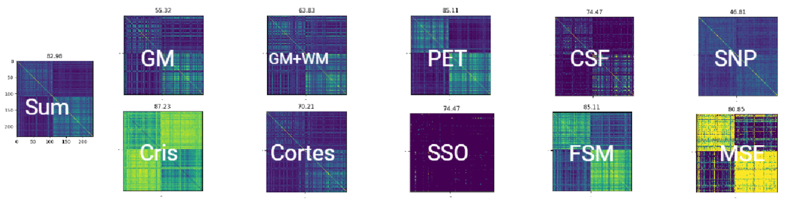

# Deep Kernel Learning (DKL)



Combining multikernels through deep learning

## Features

- Supervised kernels
- Generalize multi-kernel learning with different losses
  
  - MSE
  - Centeral alignment [1]
  - Centeral alignment [2]
  - Feature space-based kernel matrix [3]
  - Structure risk optimization [4]


## Requirements

```
pip install -r requirements.txt
```


## How to run 
```
./run_train.sh  
```
## Data and Preprocessing 


## Data and Preprocessing 

- **Dataset**: [Alzheimer's Disease Neuroimaging Initiative (ADNI)](http://adni.loni.usc.edu/)

- **Preprocessing**:
  - **MRI**: Processed using the [CAT toolbox](https://neuro-jena.github.io/cat/
) combined with the [Schaefer atlas](https://github.com/ThomasYeoLab/CBIG/tree/master/stable_projects/brain_parcellation/Schaefer2018_LocalGlobal).
  - **CSF (Cerebrospinal Fluid)**: Data with missing values were excluded.
  - **PET (Positron Emission Tomography)**: Images were aligned and normalized using [ANTS registration](https://github.com/ANTsX/ANTs).
  - **SNP (Single Nucleotide Polymorphisms)**: Counting the number of minor variances.


# References
 
[1] Nello Cristianini, John Shawe-Taylor, André Elisseeff, and Jaz Kandola. On Kernel-Target Alignment. In Advances in Neural Information Processing Systems, volume 14. MIT Press, 2001.

[2] Corinna Cortes, M. Mohri, and Afshin Rostamizadeh. Two-Stage Learning Kernel Algorithms. June 2010.


[3] Canh Hao Nguyen and Tu Bao Ho. An efficient kernel matrix evaluation measure. Pattern Recognition, 41(11):3366–3372, November 2008.

[4] Gert R. G. Lanckriet, Nello Cristianini, Peter Bartlett, Laurent El Ghaoui, and Michael I. Jordan. Learning the Kernel Matrix with Semidefinite Programming. Journal of Machine Learning Research, 5(Jan):27–72, 2004.